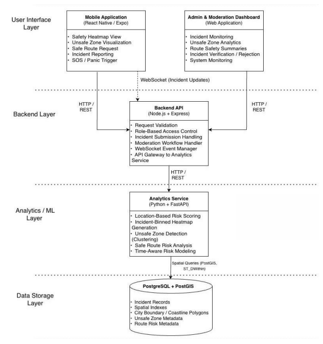

# SafeNaari

**Women’s safety companion** — heatmaps, community incident reports, ML-assisted **safer route suggestions**, a **panic** flow with real-time signals, and an **admin** dashboard for moderation and audit.

Hackathon / portfolio project: end-to-end mobile + API + ML + admin. Configure your own keys locally (see [Quick start](#quick-start) and [Security](#security-secrets)).

---

## Demo & deck

| Resource | Link |
|----------|------|
| **Demo video** | [YouTube — SafeNaari demo](https://youtu.be/KVj8XXxT_ZY) |
| **Pitch deck (Canva)** | [Open presentation](https://canva.link/ad78ijqihv77a7r) |

---

## The problem

Urban safety is uneven in space and time: people lack **at-a-glance risk context** where they walk, **trusted community signals** are scattered, and in distress there is no single flow that combines **location**, **alerts**, and **operator visibility**. Static maps and generic navigation do not encode **safety-weighted** choices.

---

## Our solution

SafeNaari brings **risk visualization**, **crowdsourced reports**, and **route planning** into one Expo app, backed by a **Node API** and a **Python ML service** that clusters incidents and scores paths. An **admin** web app lets moderators review incidents, audit actions, and keep the dataset trustworthy. **WebSockets** support live-style updates where enabled (e.g. panic / alerts).

---

## Key features

- **Risk heatmap** — Map overlay built from report density / ML outputs so users see hotter vs calmer areas.
- **Community reports** — Submit and browse incidents (with moderation hooks via admin).
- **Safer routes** — Google Routes / directions combined with **ML risk scoring** to compare path options.
- **Panic flow** — Distress workflow with location and signaling (integrates with your configured notification / socket stack).
- **Auth-ready mobile** — Optional JWT-gated API for registered users (`MOBILE_AUTH_REQUIRED`).
- **Admin dashboard** — Incidents, audit trail, analytics-oriented views (Vite + React).

---

## Architecture

High-level system diagram:



| Layer | Tech | Role |
|--------|------|------|
| **Mobile** | Expo / React Native | Heatmap, reports, panic, routes, auth |
| **Admin** | React + Vite | Incidents, audit, analytics |
| **API** | Node.js + Express | Auth, reports, location, Google proxy, WebSockets |
| **ML** | Python + FastAPI | Heatmap, clustering, route risk analysis |

---

## Prerequisites

- **Node.js** 20+ (LTS recommended)
- **Python** 3.11+ (for ML)
- **PostgreSQL** (optional; API can run with reduced features without it)
- **Google Cloud** project with billing (Places, Geocoding, Routes; separate Maps SDK keys for map **tiles** on device)

---

## Quick start

### 1. ML service (`backend/ml`)

```bash
cd backend/ml
python -m venv .venv
# Windows: .venv\Scripts\activate
pip install -r requirements.txt
uvicorn app.main:app --host 0.0.0.0 --port 8000 --reload
```

### 2. API (`backend/api`)

```bash
cd backend/api
cp .env.example .env
# Edit .env: GOOGLE_MAPS_API_KEY, ADMIN_PASSWORD, ML_SERVICE_URL, optional DATABASE_URL / Twilio
npm install
npm run dev
```

API listens on **3001** by default (`http://localhost:3001`). Health: `GET /health`.

### 3. Admin (`frontend/admin`)

```bash
cd frontend/admin
npm install
```

Point Vite at your API: in `vite.config.ts`, set the `server.proxy` target to your machine’s LAN IP if testing from another device (e.g. `http://192.168.x.x:3001`).

```bash
npm run dev
```

### 4. Mobile (`frontend/mobile`)

```bash
cd frontend/mobile
cp .env.example .env
# Set GOOGLE_MAPS_NATIVE_API_KEY (Maps SDK for Android/iOS — restrict by package + SHA-1 in Google Cloud)
npm install
```

In `src/services/api.ts`, set **`API_BASE_URL`** in the `__DEV__` branch to your computer’s **LAN IP** and port **3001** (same Wi‑Fi as the phone), or use Expo tunnel + a reachable host.

```bash
npx expo start
```

**Map tiles (Google):** Keys are **not** stored in `app.json`. `app.config.js` reads **`GOOGLE_MAPS_NATIVE_API_KEY`** from `frontend/mobile/.env` (local) or **EAS Secrets** (cloud builds). Enable **Maps SDK for Android / iOS** for that key. Backend Places/Routes/Geocode use **`GOOGLE_MAPS_API_KEY`** in `backend/api/.env` (can be a different key restricted for server use).

**Dev client / native modules:** use `expo run:android` / EAS after changing native config.

---

## Security (secrets)

- **Never commit** `.env` files or paste API keys into tracked JSON/TS.
- If keys ever appeared in Git history, **rotate them in Google Cloud / Twilio / JWT** immediately; scanners keep old commits. To scrub history use [git-filter-repo](https://github.com/newren/git-filter-repo) or make a **new repo** with a squashed clean tree.
- **Admin login** requires **`ADMIN_PASSWORD`** or **`ADMIN_SECRET`** in the API `.env` (there is no default password in code).

---

## Environment variables (API)

See `backend/api/.env.example`. Important:

- **`GOOGLE_MAPS_API_KEY`** — server calls (Places, Geocoding, Routes, Directions fallback).
- **`ADMIN_PASSWORD`** or **`ADMIN_SECRET`** — required for admin dashboard login.
- **`ML_SERVICE_URL`** — e.g. `http://localhost:8000` or `http://<LAN-IP>:8000`.
- **`MOBILE_AUTH_REQUIRED`** — when `true`, mobile must send `Authorization: Bearer <token>` from login/register.
- **`DATABASE_URL`** — optional Postgres; URL-encode special characters in passwords (`@` → `%40`).

---

## Project layout

```
archi_diag/      System architecture diagram (`architecture.png`)
backend/api/     Express API + Socket.IO
backend/ml/      FastAPI ML service
frontend/mobile/ Expo app
frontend/admin/  Vite admin SPA
```

---

## Scripts (optional)

- `backend/api`: `npm run build`, `npm start` (compiled `dist/`)
- `backend/api/scripts/free-port.js` — used by `nodemon` on Windows to free port 3001 before restart

---

## License

MIT (see repository if `LICENSE` is added).
